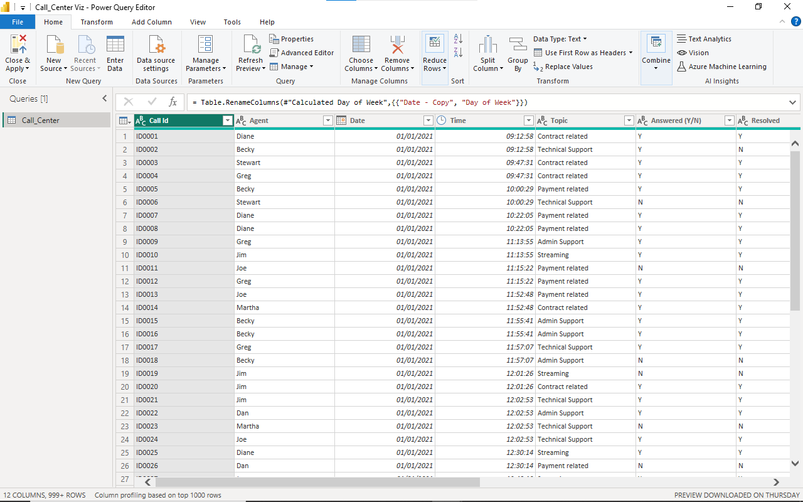
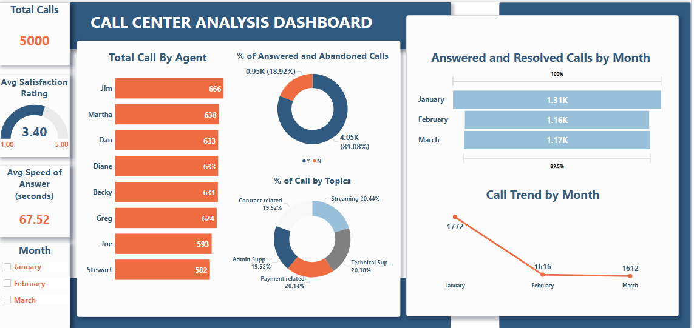
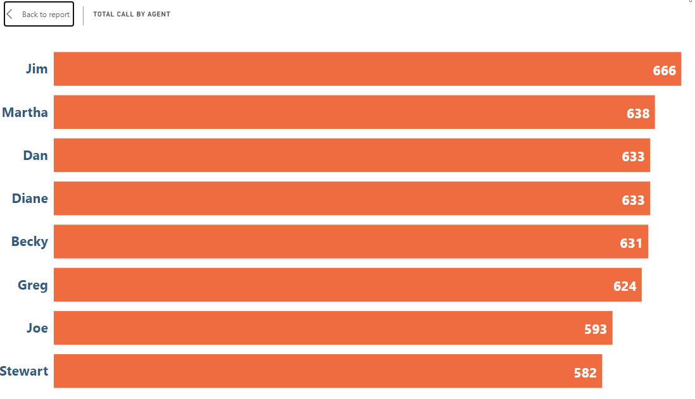
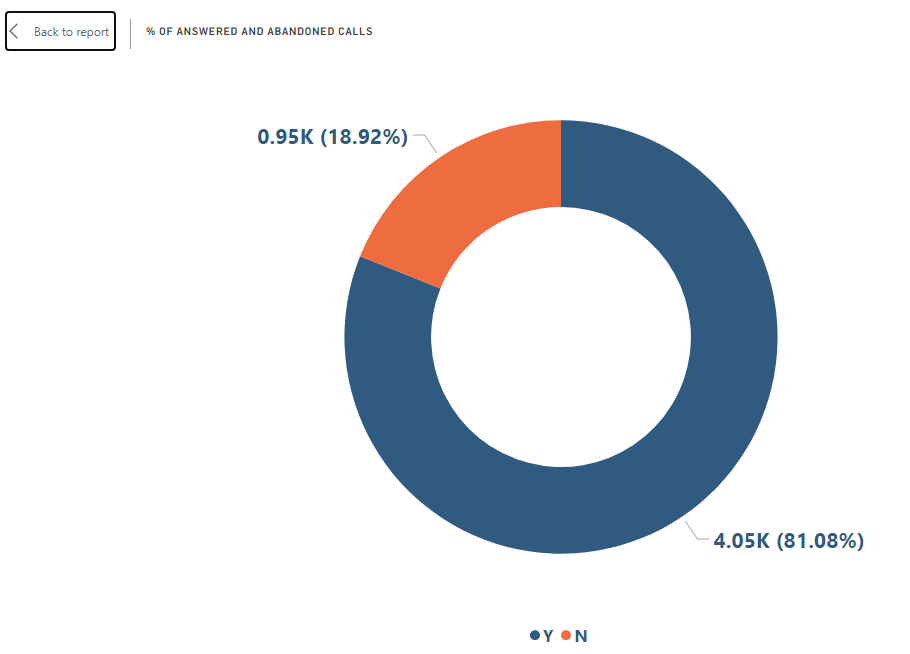
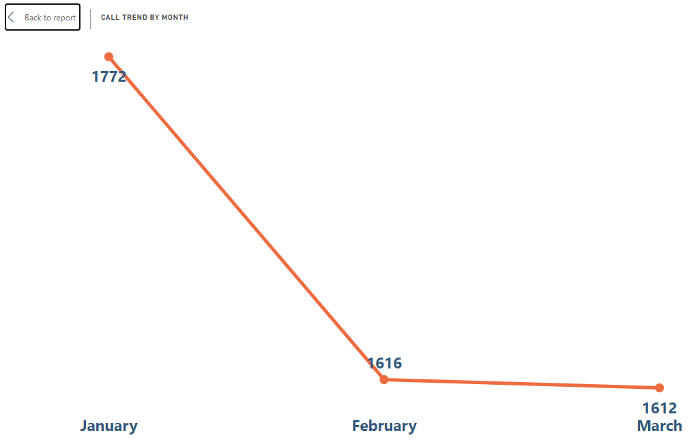

# CALL CENTER REPORT 

## INTRODUCTION

This dataset gives descriptive information on the calls that were received by a call center in the first quarter of 2015

It contains the following information: 
Call ID, 
Agent who received the call, 
Date, Time, Topic, 
if it was Answered or not, 
if it was resolved or not
speed of Answering the call in seconds, Avg talk duration, Satisfaction rating.

### SKILLS/CONCEPT DEMONSTRATED

Table Structuring, Data cleaning, powerQuery, Data Transformation, Data analysis & visualization

### PROBLEM STATEMENT

This dataset contains the data from a call center in 2015 QTR1 and was tasked to analyze this dataset and provide insights from the analysis 

The questions asked were:
Total Calls 
Average speed of answer in seconds 
Average satisfaction
Call trend by months
Total calls by agents
% of calls by Topics
Compare answered and abandoned calls 
Answered and resolved calls by month

#### DATA TRANSFORMATION AND CLEANING

The Data was structured in Excel and transformed in the power query editor

Additional columns were added into the dataset, the name of day which groups the dates by name of days of the week, and the day of the week which attributes number to each day of the week. This was done to further categorize the date column into days and arrange it orderly
The data was saved and loaded into the visualization pane

### DATA VISUALIZATION

It was ensured that the design and color applied to the report were visually appealing and did distort user's focus from the insight got from the visuals

### DATA Analysis & Recommendation

The following questions were answered through visualization

**Total calls by Agents**

The total calls  by each  agents is relatively evenly spread out this shows that no particular agent is task to answer a chunk of the calls. This is good as no agent would feel a sense of entitlement, superiority, inferiority or overburdened

**% of answered and abandoned calls** 

The total answered calls far outweighs the abandoned calls. This is quite impressive as it shows commitment in solving there customers issues , but there is always room for improvement.

**Average Satisfaction rating**

Average satisfaction rating is at 3.40 which represents a 68%. This is quite positive and shows more customers are satisfied with with their service, although there is still much space for improvement.

**Call trend by month**

There was an obvious decline in the total calls received from January to February and a very slight further decline into the month of March. If this trend continues further into the year a diagnostic analysis needs to be done to get to the root cause of this occurrence

